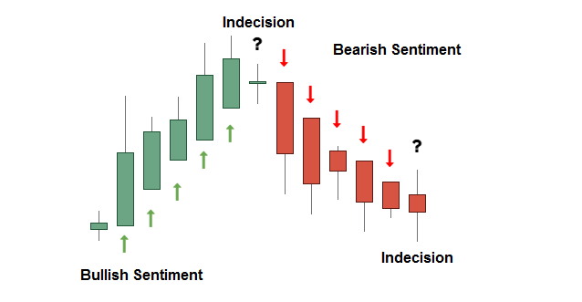
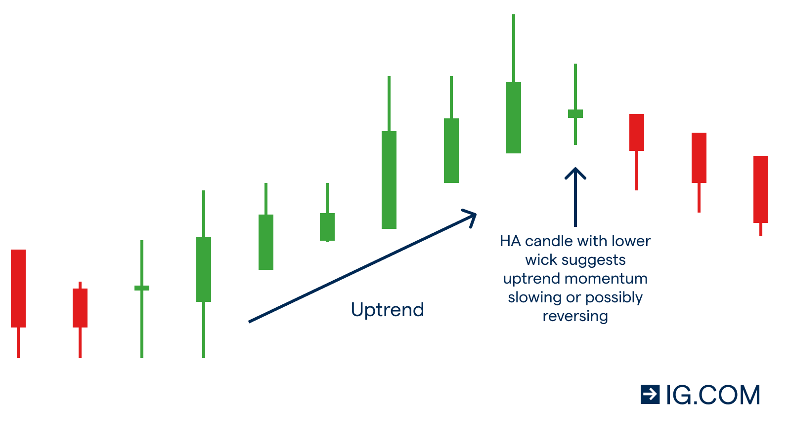

# Crypto-Trading-Bot

# Binance Trading Bot

The **Binance Trading Bot** was developed as an automated trading solution designed to seize minor bullish movements detected in Heikin Ashi candlestick charts. The bot specialized in identifying favorable market conditions, executing sell orders when a profitable threshold was met, and optimizing cryptocurrency trading strategies.

## Overview

The **Binance Trading Bot** operated using a sophisticated algorithm meticulously crafted to monitor Heikin Ashi candlestick charts. Its primary objective was to identify minor bullish trends that indicated potential profit opportunities. Once such trends were recognized, the bot triggered timely sell orders, aiming to secure gains surpassing a predefined threshold. This methodology allowed traders to capitalize on swift price fluctuations, effectively navigating dynamic cryptocurrency markets.

## Functionality

1. **Heikin Ashi Analysis:** The bot meticulously analyzed Heikin Ashi candlestick charts to pinpoint minor bullish movements indicative of potential profitability.

2. **Profit-Oriented Approach:** The algorithm executed sell orders when the expected profit exceeded a preset threshold. This proactive strategy ensured that trades were initiated only when the projected gain surpassed the predefined amount.

3. **Cryptocurrency Selection:** Traders could customize the bot by selecting a specific cryptocurrency to target. This tailored approach allowed the bot to focus its trading strategy on a singular asset, enhancing its ability to optimize trading outcomes.

## Visual Analysis

The bot's functionality is visually exemplified through the following images:

## Project Purpose

The core objective of the **Binance Trading Bot** was to streamline cryptocurrency trading by automating the detection and exploitation of minor bullish price movements. The bot's ability to initiate sell orders based on predefined profit targets provided traders with a systematic framework to enhance their trading strategies.

## Future Developments

While the **Binance Trading Bot** primarily concentrated on capturing minor bullish runs, its potential for evolution remains promising. Future enhancements could encompass the integration of additional technical indicators, dynamic risk management protocols, and adaptability to diverse market conditions. As the cryptocurrency landscape continues to evolve, the bot's adaptability will continue to be a pivotal feature.

`WazirX price notifier` was a code written to alert the sharp rise and fall in the prices of all cryptocurrencies listed on the exchnage. It used to show percentage change and corresponding crypto's name who had increased/decreased more than certain % in under certain time interval with the use of windows notifier.

The **Binance Trading Bot** project represents a significant stride in harnessing algorithmic trading to optimize trading efficacy. Its modular architecture ensures potential for ongoing innovation within the dynamic cryptocurrency market landscape.

